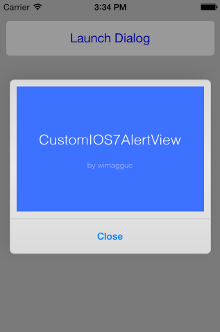

# Custom iOS7 AlertView

`v0.81`

The addSubview is not available in UIAlertView in iOS7 any more. The view hierarchy for this class is private and must not be modified.

As a solution, this class creates an iOS7-style dialog which you can extend with any UIViews or buttons. The animations and the looks are copied too and no images or other resources are needed.



## Install

As simple as adding the following files to your project:

* CustomIOS7AlertView.h
* CustomIOS7AlertView.m

## Change notes

The initWithParentView method is now deprecated. Please use the init method instead, where you don't need to pass a parent view at all. **In case the init doesn't work for you, please leave a note or open an issue here.**

## Quick start guide

1. Create the UIView object `changed`

    ```
    CustomIOS7AlertView *alertView = [[CustomIOS7AlertView alloc] init];
    ```
  
2. Add some custom content to the alert view (optional)

    ```
    UIView *customView ..;

    [alertView setContainerView:customView];
    ```

3. Display the dialog

    ```
    [alertView show];
    ```

## More functions

* Close the dialog

    ```
    [alertView close];
    ```

* To add more buttons, pass a list of titles

    ```
    [alertView setButtonTitles:[NSMutableArray arrayWithObjects:@"Button1", @"Button2", @"Button3", nil]];
    ```

* You can remove all buttons by passing nil

    ```
    [alertView setButtonTitles:NULL];
    ```

* You can enable or disable the iOS7 parallax effects on the alert view

    ```
    [alertView setUseMotionEffects:TRUE];
    ```

* Handle button clicks with a custom delegate

    First, set the delegate:

    ```
    [alertView setDelegate:self];
    ```

    Then add the delegate methods:

    ```
    - (void)customIOS7dialogButtonTouchUpInside: (CustomIOS7AlertView *)alertView clickedButtonAtIndex: (NSInteger)buttonIndex
    {
        NSLog(@"Button at position %d is clicked on alertView %d.", buttonIndex, [alertView tag]);
    }
    ```

* Handle button clicks with a code block

    ```
    [alertView setOnButtonTouchUpInside:^(CustomIOS7AlertView *alertView, int buttonIndex) {
        NSLog(@"Block: Button at position %d is clicked on alertView %d.", buttonIndex, [alertView tag]);
        [alertView close];
    }];
    ```

    You can also disable all other delegates by:

    ```
[alertView setDelegate:self];
    ```

## Todos

This is a really quick implementation, and there are a few things missing:

* Adding more buttons: they don't exactly match the look with that of on iOS7

* Rotation: rotates wrong with the keyboard on

## Special thanks to

* [@tamasdancsi](https://github.com/tamasdancsi) for his support with the initial code  
* [@dingosky](https://github.com/dingosky) for his work on the parallax effects code  
* [@raspu](https://github.com/raspu) for his work on the protocol delegates, iOS6 support and onButtonClick blocks  
* [@sbandol](https://github.com/sbandol) for his idea on adding the AlertView as the top most view in the hierarchy
* [@scorpiozj](https://github.com/scorpiozj) for his work on the rotation code
* [@kwent](https://github.com/kwent) for adding performance optimisations
* [@thomasaw](https://github.com/thomasaw) for the refract on the deprecated initWithParentview

## License

**Please feel free to push back anything you think is useful for the project.**

`License info is here for request. Please suggest a better one if you are familiar with copyright.`

Copyright (c) 2013 Richard Dancsi

Lincesed under [The MIT License](http://opensource.org/licenses/MIT) (MIT)

Permission is hereby granted, free of charge, to any person obtaining a copy
of this software and associated documentation files (the "Software"), to deal
in the Software without restriction, including without limitation the rights
to use, copy, modify, merge, publish, distribute, sublicense, and/or sell
copies of the Software, and to permit persons to whom the Software is
furnished to do so, subject to the following conditions:

The above copyright notice and this permission notice shall be included in
all copies or substantial portions of the Software.

THE SOFTWARE IS PROVIDED "AS IS", WITHOUT WARRANTY OF ANY KIND, EXPRESS OR
IMPLIED, INCLUDING BUT NOT LIMITED TO THE WARRANTIES OF MERCHANTABILITY,
FITNESS FOR A PARTICULAR PURPOSE AND NONINFRINGEMENT. IN NO EVENT SHALL THE
AUTHORS OR COPYRIGHT HOLDERS BE LIABLE FOR ANY CLAIM, DAMAGES OR OTHER
LIABILITY, WHETHER IN AN ACTION OF CONTRACT, TORT OR OTHERWISE, ARISING FROM,
OUT OF OR IN CONNECTION WITH THE SOFTWARE OR THE USE OR OTHER DEALINGS IN
THE SOFTWARE.

## Other projects

Check out [AppWoodoo](http://www.appwoodoo.com/), our remote app settings (and A/B testing) service. It's open source and free to use.

Some more of my free stuff for web devs at [Github](https://github.com/wimagguc?tab=repositories).

Project updates [newsletter](http://wimagguc.us4.list-manage.com/subscribe/post?u=83343dbd708d35d76618f66c5&id=da7cc7f1dc)

## About

Richard Dancsi  
[www.wimagguc.com](http://www.wimagguc.com/)  

twitter: [@wimagguc](http://twitter.com/wimagguc)  
linkedin: [linkedin.com/in/richarddancsi](http://linkedin.com/in/richarddancsi)  
gplus: [plus.google.com/u/0/115939246085616544919](https://plus.google.com/u/0/115939246085616544919)  
